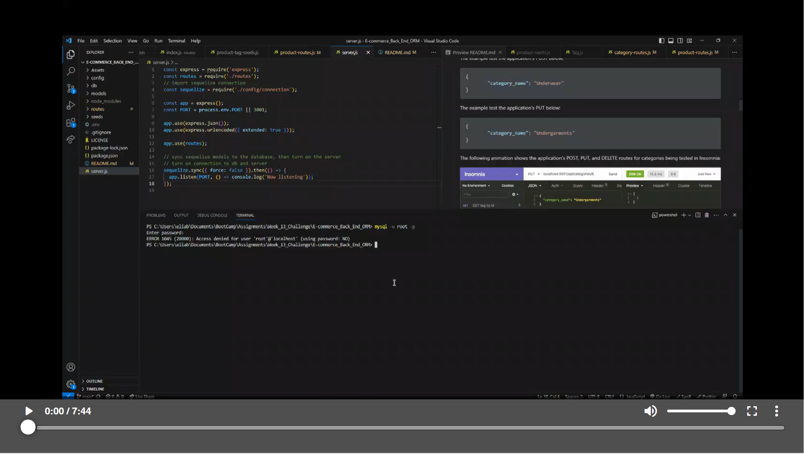

# E-Commerce Back End (ORM): 
Using Object-Relational Mapping(ORM) to build the back end for an e-commerce site by modifying code and configuring with Express.js API to use Sequelize to interact with a MySQL database.

## Why

Internet retail, also known as **e-commerce**, plays a significant role within the electronics industry, as it empowers businesses and consumers alike to conveniently engage in online buying and selling of electronic products. In the latest available data from 2021, the industry in the United States alone was estimated to have generated the substantial amount of US$2.54 trillion, according to the United Nations Conference on Trade and Development. E-commerce platforms like Shopify and WooCommerce provide a suite of services to businesses of all sizes. **Due to the prevalence of these platforms, developers should understand the fundamental architecture of e-commerce sites**.

## User Story

```md
AS A manager at an internet retail company
I WANT a back end for my e-commerce website that uses the latest technologies
SO THAT my company can compete with other e-commerce companies
```

## Preview/Testing

> **Important**: `Insomnia` was for testing the application's GET, POST, PUT, and DELETE routes forall models

The following animation shows the application's GET routes to return all categories, all products, and all tags being tested in Insomnia:


The following animation shows the application's GET routes to return a single category, a single product, and a single tag being tested in Insomnia:


The example test the application's POST below:

```json
{
		"category_name": "Underwear"
}
```

The example test the application's PUT below:

```json
{
		"category_name": "Undergarments"
}
```

The following animation shows the application's POST, PUT, and DELETE routes for categories being tested in Insomnia:


## Demonstration

Because this application won’t be deployed, here is a walkthrough video that demonstrates its functionality.

Click the link for the [](https://watch.screencastify.com/v/BMyqCqT1wDzcLfzO3U3p)

## Additional Information:

> **Important**: [MySQL2](https://www.npmjs.com/package/mysql2) and [Sequelize](https://www.npmjs.com/package/sequelize) packages were used to connect with Express.js API to MySQL database and the [dotenv](https://www.npmjs.com/package/dotenv) package to use environment variables to store sensitive data.
### Creating database - `MySQL`
The `schema.sql` file in the `db` folder is used to create the database with MySQL shell commands.

Using an `.env file` (environment variables) to store sensitive data like your MySQL username, password, and database name.

### Seed the Database; 
Run `npm run seed` to seed data to your database so that you can test your routes.

### CRUD Operations in API Routes: 
Routes in `product-routes.js`, `tag-routes.js`, and `category-routes.js` perform create, read, update, and delete operations using your Sequelize models.

The application will be invoked by using the following command after seeding database:

```bash
use > npm start < for => node server.js
```
### Database Models

Refer to the following database for the four models;

* `Category`

  * `id`

    * Integer.
  
    * Doesn't allow null values.
  
    * Set as primary key.
  
    * Uses auto increment.

  * `category_name`
  
    * String.
  
    * Doesn't allow null values.

* `Product`

  * `id`
  
    * Integer.
  
    * Doesn't allow null values.
  
    * Set as primary key.
  
    * Uses auto increment.

  * `product_name`
  
    * String.
  
    * Doesn't allow null values.

  * `price`
  
    * Decimal.
  
    * Doesn't allow null values.
  
    * Validates that the value is a decimal.

  * `stock`
  
    * Integer.
  
    * Doesn't allow null values.
  
    * Set a default value of `10`.
  
    * Validates that the value is numeric.

  * `category_id`
  
    * Integer.
  
    * References the `Category` model's `id`.

* `Tag`

  * `id`
  
    * Integer.
  
    * Doesn't allow null values.
  
    * Set as primary key.
  
    * Uses auto increment.

  * `tag_name`
  
    * String.

* `ProductTag`

  * `id`

    * Integer.

    * Doesn't allow null values.

    * Set as primary key.

    * Uses auto increment.

  * `product_id`

    * Integer.

    * References the `Product` model's `id`.

  * `tag_id`

    * Integer.

    * References the `Tag` model's `id`.

### Associations/Relationship

* `Product` belongs to `Category`, and `Category` has many `Product` models, as a category can have multiple products but a product can only belong to one category.

* `Product` belongs to many `Tag` models, and `Tag` belongs to many `Product` models. Allow products to have multiple tags and tags to have many products by using the `ProductTag` through model.


## License

This project license is under the [MIT](https://opensource.org/licenses/MIT)

---
## Resources USED

* [MySQL2](https://www.npmjs.com/package/mysql2)

* [Sequelize](https://www.npmjs.com/package/sequelize)

* [dotenv](https://www.npmjs.com/package/dotenv)
